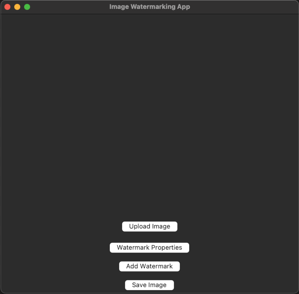
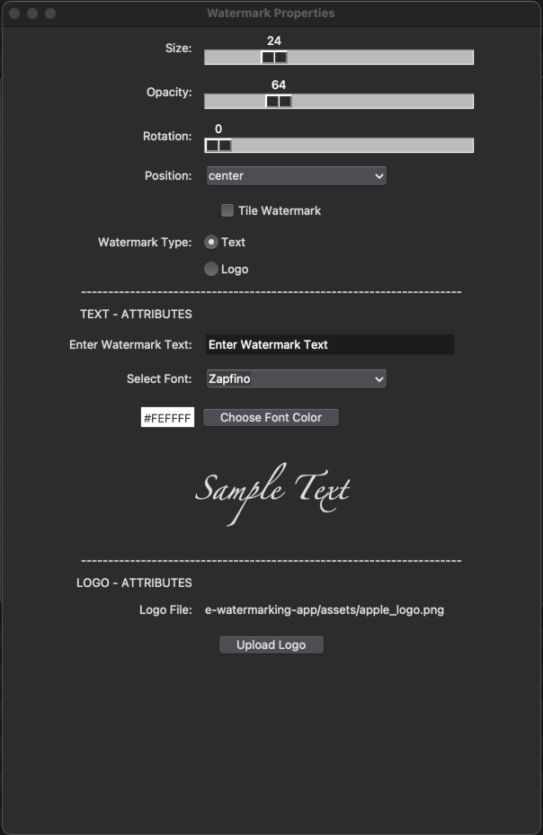
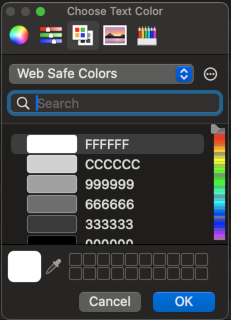
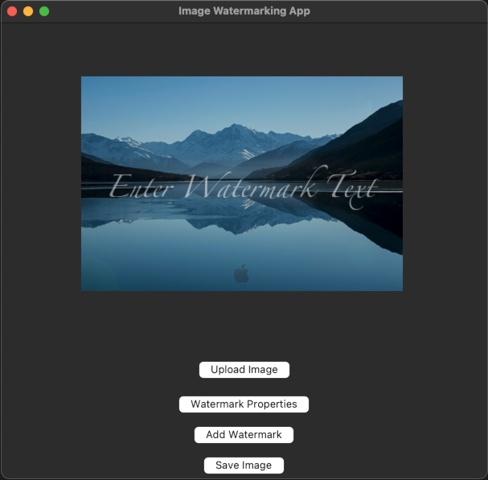

# Image Watermarking App

This is a simple Python desktop application built with Tkinter that allows users to add a watermark to images.

## Features
- Upload an image
- Add a custom watermark (text or logo)
- Save the watermarked image

## Demo
Screenshot showing program in action.


Upload image to have watermark applied.


Adjust watermark properties.

Change watermark text color if desired.


Add watermark(s) to image.


Save watermarked image.


## Installation
#### Prerequisites
* Python 3.x installed on your machine.
* (Optional) A virtual environment for isolated dependencies.

### Steps
1. Clone the repository:
```sh
git clone https://github.com/Garschke/image-watermarking-app.git
cd image-watermarking-app
```

2. (Optional) Create a virtual environment:
```sh
python3 -m venv venv
source venv/bin/activate  # On Windows, use venv\Scripts\activate
```
3. Install dependencies:
```sh
pip install -r requirements.txt
```

## Usage

Run the application:
```sh
python3 watermark_app.py
```
Follow the steps from the Demo:
Load image to have watermark applied.
Adjust watermark properties.
Add watermark(s).
Save watermarked image.

## Dependencies
* Python 3
* Tkinter
* Pillow

## License
This project is licensed under the MIT License - see the LICENSE file for details.

